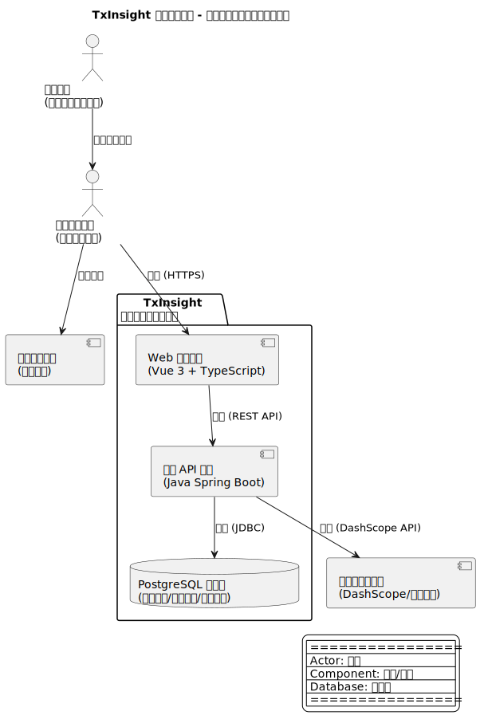
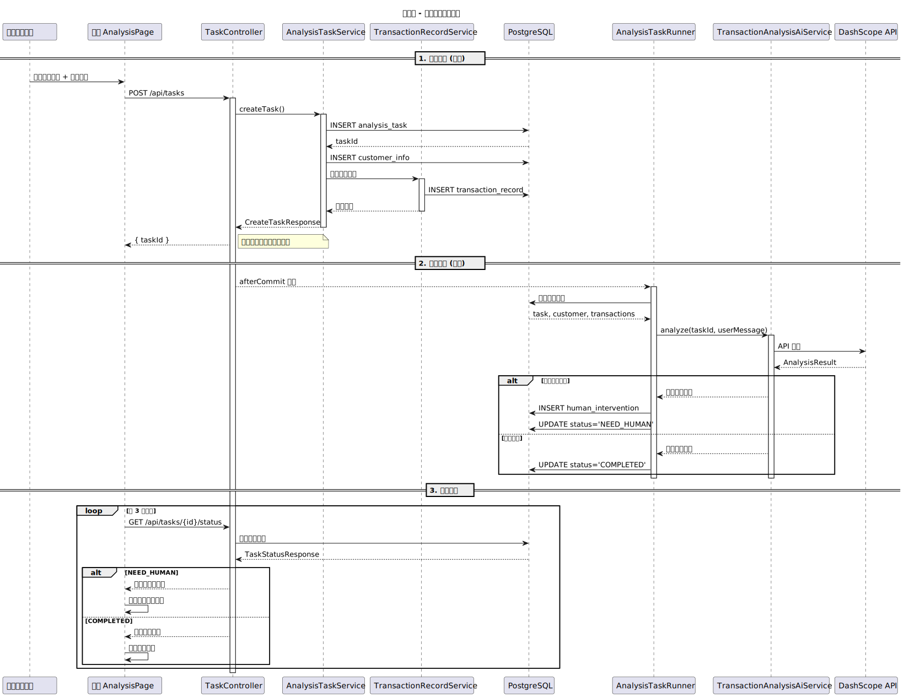

# arch-xray 架构 X 光

> 一眼看透你的代码库

---

## ✨ 能做什么？

| 功能              | 说明                                                          |
| ----------------- | ------------------------------------------------------------- |
| 📐**生成架构图**   | C4 标准 PlantUML 图表（Context/Container/Component/Sequence） |
| 🔍**分析代码结构** | 文件夹组织、文件互动、函数调用链                              |
| 🛠️**技术栈识别**   | 自动识别框架、库和核心技术                                    |
| 📋**代码审查**     | 指出 bug、安全漏洞、最佳实践建议                              |
| 📚**语言教学**     | 项目使用的编程语言语法教学                                    |
| 🧭**开发引导**     | 实现新功能的详细步骤                                          |

---

## 📁 输出示例

运行后生成 `xray/` 目录：

```
xray/
├── README.md                        # 快速开始指南
├── docs/
│   ├── architecture-overview.md     # 架构概览（含 SVG 图）
│   ├── component-details.md         # 组件详情
│   ├── data-flow.md                 # 数据流分析
│   ├── project-structure.md         # 项目结构说明
│   ├── code-review.md               # 代码审查报告
│   └── language-tutorials/          # 编程语言教程
└── assets/diagrams/
    ├── context.puml / .svg          # 系统上下文图
    ├── container.puml / .svg        # 容器图
    ├── component-Core.puml / .svg   # 核心组件图
    └── class-Domain.puml / .svg     # 类图
```

### 📸 效果图示例

**系统上下文图（Context Diagram）**



**序列图（Sequence Diagram）**



### 架构图类型

| 类型                  | 说明                       |
| --------------------- | -------------------------- |
| **Context Diagram**   | 系统与外部用户/系统的关系  |
| **Container Diagram** | 前端/后端/数据库等容器划分 |
| **Component Diagram** | 核心模块内部组件           |
| **Class Diagram**     | 关键类的设计和关系         |
| **Sequence Diagram**  | 关键业务流程的调用时序     |

---

## 🚀 Quick Start

### 1. 安装 PlantUML

**macOS**

```bash
brew install plantuml
```

**Linux**

```bash
sudo apt-get install plantuml
```

**Windows**

```powershell
scoop install plantuml
# 或
choco install plantuml
```

> 💡 **懒人方法**：直接告诉 AI Agent
> "检测我的运行系统环境，帮我安装 plantuml，参考链接：https://github.com/plantuml-stdlib/C4-PlantUML"

### 2. 安装 arch-xray

使用 [OpenSkills](https://github.com/numman-ali/openskills) 安装技能：

```bash
# 安装 OpenSkills（可选）
npm i -g openskills

# 一键安装 arch-xray
npx openskills install keloshen/arch-xray

# 确认安装
npx openskills list
```

---

## 💡 如何使用

### 自动触发

当你说这些话时，技能会**自动激活**：

- "我想学习这个代码库"
- "这个系统是怎么工作的？"
- "帮我分析一下架构"
- "如何实现 X 功能？"
- "帮我画个架构图"

### 手动触发

在 Claude Code / Cursor 中输入：

```
/arch-xray
```

然后描述你的需求即可。

---

## 📖 使用示例

| 场景             | 命令                                            |
| ---------------- | ----------------------------------------------- |
| **分析整个项目** | `帮我分析这个项目的架构，我想了解整体结构`      |
| **查看特定模块** | `分析一下 src/services 目录下的组件关系`        |
| **代码审查**     | `这段代码有什么潜在问题吗？`                    |
| **学习新技术**   | `这个项目用了 TypeScript，我不太懂，能教我吗？` |

---

> *arch-xray - 让架构一目了然*
