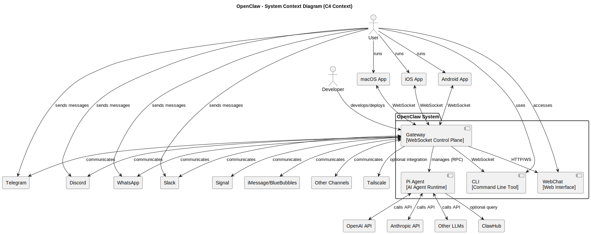
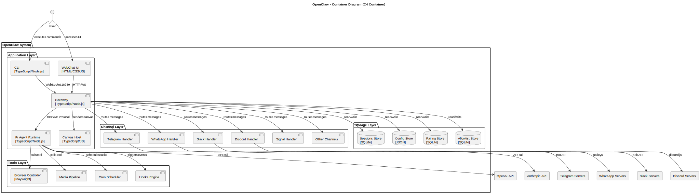
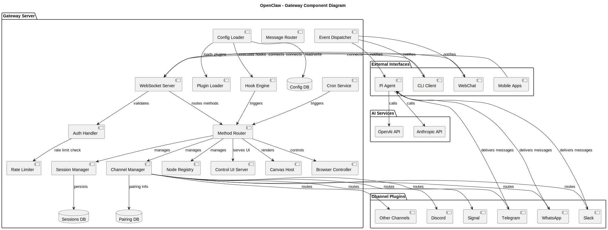
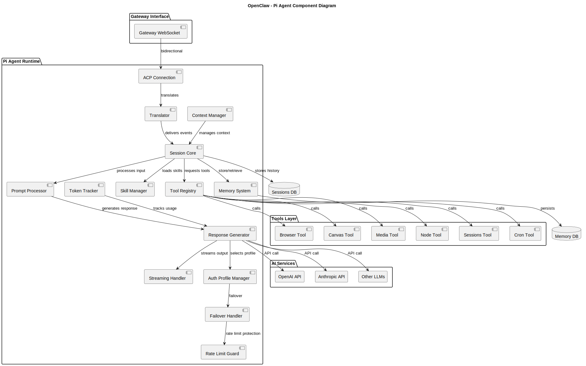
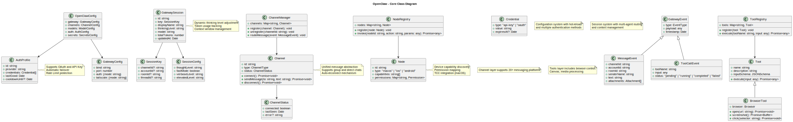

# arch-xray

> **See Through Your Codebase in 30 Minutes**

---

**🌐 Language:** **English** | [简体中文](./README.zh.md)

---

## 🎯 What Can It Do?

| Feature | Description |
|---------|-------------|
| 📐 **Generate Architecture Diagrams** | C4-standard PlantUML diagrams (Context/Container/Component/Sequence/Class) |
| 🔍 **Analyze Code Structure** | Folder organization, file interactions, function call chains |
| 🛠️ **Tech Stack Detection** | Automatically identify frameworks, libraries, and core technologies |
| 📋 **Code Review** | Identify bugs, security vulnerabilities, and best practice recommendations |
| 📚 **Language Tutorials** | Syntax tutorials for programming languages used in the project |
| 🧭 **Development Guide** | Step-by-step guidance for implementing new features |

---

## 📸 Live Demo (Analyzing OpenClaw)

Run arch-xray to generate a complete analysis report:

```
xray/
├── docs/
│   ├── architecture-overview.md     # Architecture overview (with SVG diagrams)
│   ├── component-details.md         # Component details
│   ├── data-flow.md                 # Data flow analysis
│   ├── project-structure.md         # Project structure documentation
│   ├── code-review.md               # Code review report
│   └── language-tutorials/          # Programming language tutorials
└── assets/diagrams/
    ├── context.svg                  # System context diagram
    ├── container.svg                # Container diagram
    ├── component-gateway.svg        # Gateway component diagram
    ├── component-agent.svg          # Agent component diagram
    └── class-core.svg               # Core class diagram
```

### 📊 Generated Architecture Diagrams

#### L1 - Context Diagram



Shows the relationship between the system and external users/systems

---

#### L2 - Container Diagram



Shows the distribution of applications, databases, and microservices

---

#### L3 - Component Diagram



**Internal components of the Gateway service**



**Internal components of the Pi Agent runtime**

---

#### L4 - Class Diagram



Design and relationships of core classes

---

### 📄 Generated Documentation Samples

#### Architecture Overview

Generates documentation like [architecture-overview.md](./examples/docs/architecture-overview.md), including:

- System introduction and core value proposition
- Technology stack identification and explanation
- Core subsystem details
- Data flow analysis
- Security design documentation
- Deployment architecture diagrams

#### Code Review Report

Generates reports like [code-review.md](./examples/docs/code-review.md), including:

| Dimension | Score | Description |
|-----------|-------|-------------|
| Code Quality | 4.5/5 | Type-safe, well-structured, high test coverage |
| Security | 4/5 | Good security practices, few points to note |
| Maintainability | 4.5/5 | Modular design, standardized naming, complete documentation |
| Performance | 4/5 | Reasonable optimizations, room for improvement |
| Test Coverage | 4/5 | High coverage, some edge cases could be strengthened |

**Specific Issue Analysis Example:**

```typescript
// ⚠️ Issue identified: File size exceeds recommended limit
src/gateway/server.impl.ts    ~1200 lines
src/agents/auth-profiles.ts   ~900 lines

// ✅ Recommendation: Split into smaller modules
src/gateway/
├── server.impl.ts        # Main entry point
├── server.auth.ts        # Authentication logic
├── server.methods.ts     # WS method handlers
├── server.channels.ts    # Channel management
└── server.sessions.ts    # Session management
```

**Security Risk Examples:**

| Risk Level | Issue | Recommendation |
|:-----------|:------|:---------------|
| 🔴 High | Missing prompt size limits | Add 2MB limit to prevent DoS attacks |
| 🟡 Medium | Missing input type validation | Use libraries like Zod for validation |
| 🟢 Low | Error messages may leak details | Don't return internal errors directly to users |

---

## 🚀 Quick Start

### 1. Install PlantUML

**macOS**
```bash
brew install plantuml
```

**Linux**
```bash
sudo apt-get install plantuml
```

**Windows**
```powershell
scoop install plantuml
# or
choco install plantuml
```

> 💡 **Lazy Method**: Just tell your AI Agent
> "Detect my system and install plantuml for me"

### 2. Install arch-xray

Use [OpenSkills](https://github.com/numman-ali/openskills) to load the skill:

```bash
# Install OpenSkills (optional)
npm i -g openskills

# One-click install arch-xray
npx openskills install keloshen/arch-xray

# Verify installation
npx openskills list
```

---

## 💡 How to Use

### Automatic Trigger

The skill will **auto-activate** when you say things like:

- "I want to learn this codebase"
- "How does this system work?"
- "Help me analyze the architecture"
- "How do I implement feature X?"
- "Draw an architecture diagram for me"

### Manual Trigger

In Claude Code / Cursor, type:

```
/arch-xray
```

Then describe your needs.

---

## 📖 Usage Examples

| Scenario | Command | Output |
|----------|---------|--------|
| **Analyze entire project** | `Help me analyze this project's architecture` | Context + Container diagrams + Architecture overview doc |
| **View specific module** | `Analyze the src/services directory` | Component diagram + File interaction analysis |
| **Code review** | `Are there any potential issues with this code?` | Risk list + Improvement recommendations |
| **Learn new technology** | `This project uses TypeScript, teach me` | Syntax tutorial + Project examples |
| **Develop new feature** | `How do I add a new API endpoint?` | Step-by-step guide + List of relevant files |

---

## 📁 Complete Output Structure

Check the [examples/](./examples/) directory for a complete OpenClaw analysis report:

- [Architecture Overview](./examples/docs/architecture-overview.md)
- [Component Details](./examples/docs/component-details.md)
- [Data Flow Analysis](./examples/docs/data-flow.md)
- [Code Review Report](./examples/docs/code-review.md)
- [Project Structure](./examples/docs/project-structure.md)
- [TypeScript Tutorial](./examples/docs/language-tutorials/typescript-basics.md)

---

> *arch-xray - Making architecture clear at a glance*
